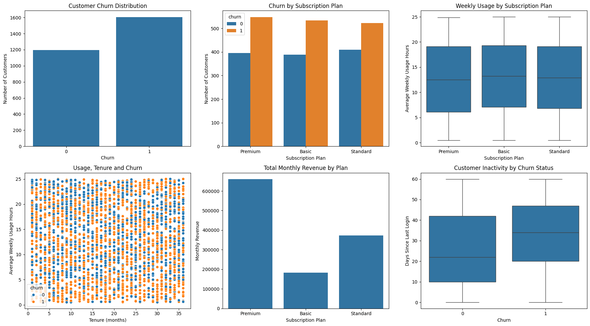

# SaaS Customer Subscription and Churn Analysis


---

This is my capstone project for Tutedude's Business Analytics Course, analyzing customer behavior and churn for a SaaS business. SaaS companies live and die by retention, so I wanted to dig into a customer dataset and see what actually separates the customers who stick around from the ones who cancel.

## What I was trying to answer

Basically: why are customers churning, and what could the business do about it? I looked at this through a few lenses — how much customers use the product, how they interact with support, how much revenue each plan brings in, and how all of that connects to churn.

## The dataset

Each row is a customer, with fields like:
- `signup_date`
- `plan_type` (Basic / Standard / Premium)
- `monthly_fee`
- `tenure_months`
- `avg_weekly_usage_hours`
- `last_login_days_ago`
- `support_tickets`
- `churn` (Yes/No)

## How I approached it

I kept the notebook organized in stages so it reads top to bottom like a real analysis, not just a pile of charts:

1. **Exploring the data** – shape, dtypes, quick stats to get a feel for it
2. **Cleaning it up** – checked for nulls/duplicates, converted signup date to datetime, mapped churn to 0/1
3. **Engagement** – how usage hours differ across plans and tenure
4. **Retention** – churn rate overall, and how it breaks down by plan, tenure, usage, and login recency
5. **Revenue** – which plans actually drive the money, and whether that lines up with engagement
6. **Support** – whether support tickets have any relationship to churn or usage
7. **A summary dashboard** pulling the key visuals together
8. **Insights and recommendations** at the end, in plain business language

## What I found

Some of the more interesting takeaways:

- Churn is high overall — **57.32%** of customers in this dataset churned, so retention is clearly a real problem here, not a minor one.
- It's fairly even across plans (Premium 58%, Basic 57%, Standard 56%), so plan type alone doesn't explain much — churn isn't concentrated in one tier.
- Usage matters: churned customers averaged **12.25 hours/week** vs **13.75 hours/week** for retained ones. Not a huge gap, but consistent with the idea that disengaged customers leave.
- Inactivity is a bigger tell — churned customers hadn't logged in for **~33 days** on average vs **~26 days** for retained customers. That gap felt like the most useful early-warning signal in the data.
- Premium customers punch way above their weight on revenue — **54%** of total revenue from one tier, more than Basic and Standard combined. Losing Premium customers hurts a lot more than losing others.
- Support tickets showed some relationship with churn too, though it's worth digging into further (more tickets isn't automatically bad — it could mean either frustration or customers who care enough to reach out).

## What I'd recommend

- **Set up an early-warning system** for churn risk — flag customers who are logging in less, using the product less, filing more support tickets, or hitting payment failures.
- **Invest more in onboarding** — a stronger first-few-months experience (tutorials, guided setup, proactive check-ins) could catch a lot of this before it becomes churn.
- **Go after the quiet ones** — customers whose usage is dropping off are probably the easiest group to win back with a timely nudge, rather than waiting until they've already decided to leave.

## Tools

Python, pandas, numpy, matplotlib, seaborn — all in a Jupyter notebook.

## Files

- `saas_churn_analysis.ipynb` — the full notebook, start to finish

## Visuals



## Running it yourself

```bash
git clone https://github.com/akash-gobari/saas_churn_analysis.git
cd saas_churn_analysis
pip install pandas numpy matplotlib seaborn jupyter
jupyter notebook saas_churn_analysis.ipynb
```

The notebook pulls data directly from a public Google Sheet, so it should run as-is without needing a local CSV.

## About me
**Open to data analyst, business analyst, and other analytics roles.**

[](https://www.linkedin.com/in/akashgobari/)
[](https://github.com/akash-gobari)
